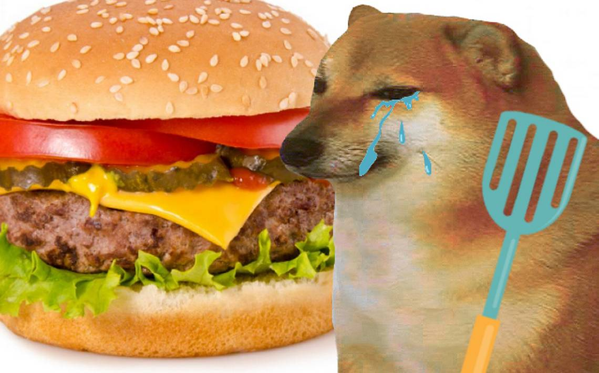
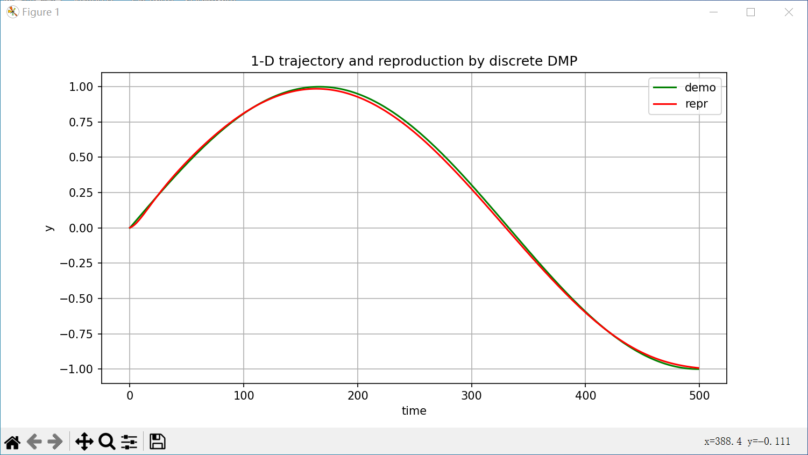
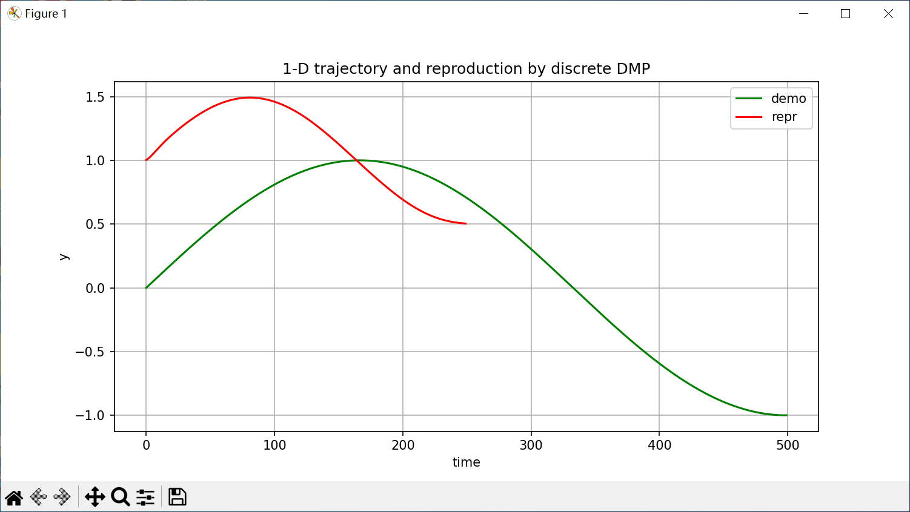
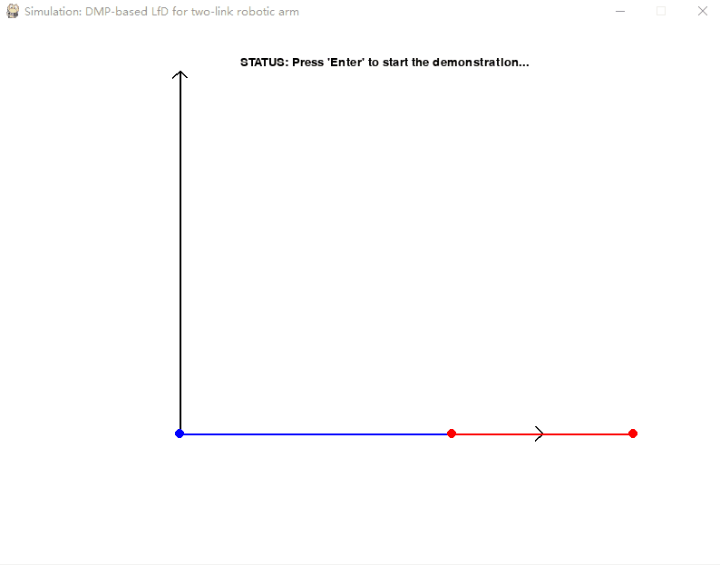
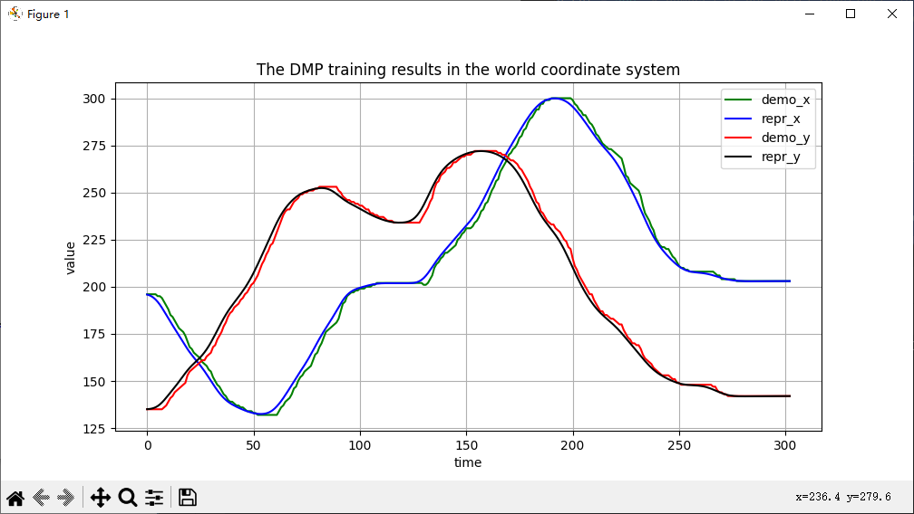
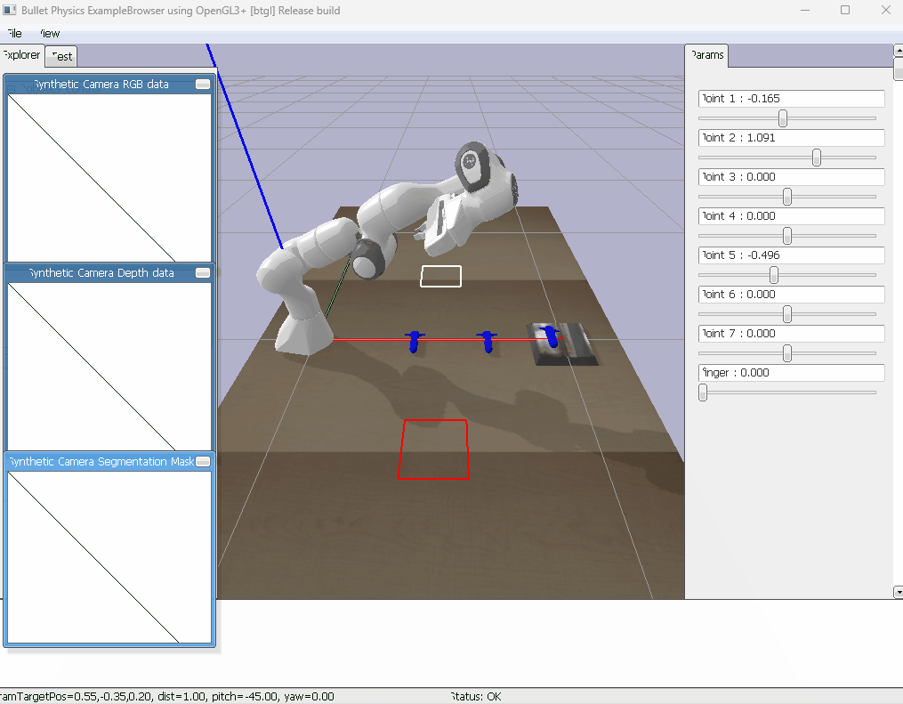

# DMP_simulation

     
     
A simulation project on `Dynamic Movement Primitive (DMP)` , containing 1D numerical simulation, 2D learning from demonstration and 3D simulation for robotic arm.

- [DMP_simulation](#dmp-simulation)
  * [1. About DMP](#1-about-dmp)
  * [2. About this project](#2-about-this-project)
  * [3. Development environment](#3-development-environment)
  * [4. Simulations and How to use](#4-simulations-and-how-to-use)
    + [A. Numerical simulation 1-D](#a-numerical-simulation-1-d)
    + [B. Two-link robotic arm learning from demonstration 2-D](#b-two-link-robotic-arm-learning-from-demonstration-2-d)
    + [C. DMP-based learning from demonstration of Emika Panda 3D (pybullet)](#c-dmp-based-learning-from-demonstration-of-emika-panda-3d--pybullet-)

<small><i><a href='http://ecotrust-canada.github.io/markdown-toc/'>Table of contents generated with markdown-toc</a></i></small>


## 1. About DMP
Supported by several experimental findings, that biological systems are able to combine and adapt basic units of motion into complex tasks, which finally lead to the formulation of the motor primitives theory. In this respect, Dynamic Movement Primitives (DMPs) represent an elegant mathematical formulation of the motor primitives as stable dynamical systems, and are well suited to generate motor commands for artificial systems like robots.

DMP was initially proposed by Schaal et al. in 2002, as the most classical theories for implementing robot imitation learning. Its various extended forms and wide-ranging applications have been prevalent in research over the past two decades.
DMP is based on a set of nonlinear differential equations to describe motion trajectories and utilizes a group of Radial Basis Functions (RBFs) for approximation and generation of movements. The DMP model can be applied to various motions, including robotic arm movements, robot path planning, human motion imitation, handwriting and speech generation, among others. 

Classic DMPs include **discrete** and **rhythmic** types, primarily composed of two components: **the forcing term** and **the feedback term**:
- The forcing term describes the desired movement trajectory, which is typically obtained through demonstrations or manually set target trajectories. It is used to guide the generated movement along the desired trajectory.
- The feedback term is employed for adaptive control, enabling the generated movement to adapt to changes and disturbances in the environment. The introduction of the feedback term provides the DMP model with robustness and adaptability.

The generation process of the DMP model includes two stages: training and reproduction. In the training stage, the parameters of the basis functions and the weights of the feedback term are adjusted by learning from the demonstrated trajectories, resulting in a suitable DMP model. In the reproduction stage, the initial conditions, motion goals, spatial scaling, and temporal scaling can be flexibly set according to the requirements. Finally, by computing the output of the DMP model using the above parameters, it is possible to achieve the reproduction or generalization of the demonstrated trajectories.

For specific theoretical details and the current researchs of DMP, you can refer to the survey: 
> Saveriano, Matteo, et al. "Dynamic movement primitives in robotics: A tutorial survey." arXiv preprint arXiv:2102.03861 (2021).

## 2. About this project
After the theoretical learning, Cheems_JH built the following three demos to further deepen the understanding and application of DMP:
- Verify the DMP model through 1D-trajectory numerical simulation
- Understanding how DMP guides a simple system to perform 2D-trajectory demonstration learning;
- Obtaining data of virtual robotic arm through 3D simulation, and exploring its implementation of demonstration learning based on DMP.

## 3. Development environment
Windows10(no GPU) + PyCharm(2023.2) + python3.9

## 4. Simulations and How to use
### A. Numerical simulation 1-D
This is a numerical simulation for 1-dimension data based on discrete DMP:
- Code path: `/python/discrete_dmp_1D.py`.
- Packages: `numpy, scipy, matplotlib`.

You can simply run this code like:
```py
# Training dmp for the demonstration
dmp = DiscreteDMP(data_set=demo_y)
# Reproduction by DMP
y_re, dy_re, ddy_re = dmp.reproduction()
```
<p align="center">
  
</p>

You can also change the start, target, and time scale during reproduction like this:
```py
y_re, dy_re, ddy_re = dmp.reproduction(start=1.0, target=0.5, tau=2.0)
```
<p align="center">
  
</p>

<details><summary><b>Show optional parameter configuration</b></summary>
     
1. Trainning DMP:
     
    ```py
    dmp = DiscreteDMP(data_set, n_rbf, alpha_y, beta_y, alpha_x, cs_runtime)
    ```
    - Usually set `beta_y=alpha_y/4`, `alpha_x=1.0` and `cs_runtime=1.0` by default.
    - The remaining parameters are freely configurable, `n_rbf` and `alpha_y` affect how well the DMP fits the demonstration. 

2. Reproducing based on DMP:

    ```py
    dmp.reproduction(self, start, target, tau):
    ```
    - The default start and target points for reproduction are the start and target points for the demonstration.
    - You can also specify new start and end points via `start` and `target`.
    - `tau` is the time scaling parameter: if `0<tau<1`, slow down; if `tau>1`, speed up.

3. Basis functions:

    ```py
    # In line 48 of the code
    self.psi_h = np.ones(self.n_rbf) * self.n_rbf ** 1.5 / self.psi_centers / self.alpha_x
    ```
    - Both the centers `self.psi_centers` and weights `self.w` of the basis functions in DMP are obtained by data training.
    - However, the width of the basis functions is based on their centers, and this mapping is set manually.
    - Usually, researchers set `psi_h=n_rbf/psi_centers`, you can also use your experience to change the mapping code on line 48.

</details>

### B. Two-link robotic arm learning from demonstration 2-D
This is a numerical simulation for 1-dimension data based on discrete DMP:
- Code path: `/python/twolink_roboticarm_dmp_2D.py`. Before run this code, you also need to download `/python/discrete_dmp_1D.py`.
- Packages: `numpy, scipy, matplotlib, sys, pygame, math, discrete_dmp_1D`.

You can see how the simulation works in the following GIF: the trajectory of the mouse drawn on the UI is used for DMP training, and the trained DMP model is further used to guide the two-link robotic arm to reproduce this skill.
<p align="center">
  
</p>

And when the UI is turned off, the program will also pop up the training effect of DMP for the demonstration:
<p align="center">
  
</p>

You can also control the rate of the roboitc arm `k_interpolation`, the accuracy of the fit `n_rbf`, and the target position and size of the generalization `start_bias_x, start_bias_y, target_bias_x, target_bias_y` by setting the parameters on lines 19-25 in source code.

As you can see in the GIF below, I drew the number 2 and set a parameter to adjust the position and enlarge the skill when generalizing:
<p align="center">
  
</p>

### C. DMP-based learning from demonstration of Emika Panda 3D (pybullet)
This is a 3D simulation for DMP based learning from demonstration of robotic arm (Emika Panda) based on Pybullet:
- Code path: `/python/panda_get_demo.py` and `/python/panda_DMP_reproduction.py`. Before run the above two codes, you also need to download `/python/discrete_dmp_1D.py` and `/python/demonstrations/demo2023-08-21_13-21-12.xlsx`.
- Packages: `pybullet, numpy, scipy, discrete_dmp_1D, openpyxl`.

STEP 1: Teaching robotic arm and get data of demonstration

You can run `/python/panda_get_demo.py` to get demonstrations: as GIF below, dragging the slider with the mouse can control the movement of each joint of the manipulator and the gripper. 
When the demonstration is over, press the keyboard 'q' key to exit, and the program will save the.xlsx file named "demo+ current time" in the current directory to store data of this demonstration.
<p align="center">
  
</p>

A demonstration is already recorded in file `/python/demonstrations/demo2023-08-21_13-21-12.xlsx` on this page, where I control the robotic arm  grabs the middle blue object and then places it into the red area.

STEP 2: Reproduction or generalization

After demonstration, you can run `/python/panda_DMP_reproduction.py` to reproduction or generalizations the demonstration.
On line 36 in code, you can read different demos by changing the value of the variable `data_path`. And you can use the parameters on lines 28 through 32 to do generalization or time scaling, as described above.

This gif is a reproduction result of a Pick-and-Place task:
<p align="center">
  
</p>

And can also generalize the task to place the object in the red area by modifying the target point:
<p align="center">
  
</p>
